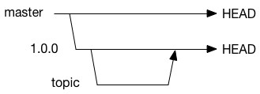
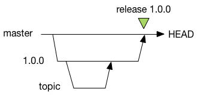
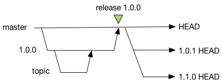

Software development typically requires a standardized branching model, to manage complexity and parallel efforts.
The branching model can be a source of confusion for developers, so this document describes how branching is used.

Taskwarrior and Taskserver use the same branching model.

## Git Branching

Git allows arbitrary and low-cost branching, which means that any branching model can be used.
A new Git repository has one branch, the default branch, named `stable`, but even this is not required.

No development occurs on the `master` branch.

## Development Branch

A development branch is created from the `master` branch, and work proceeds on the development branch.
Development branches are pushed to the server.
Note that there are no changes on `master` - all work is done on dev branches.

All work on dev branches is pushed to the server.

## Topic Branch

A topic branch is created from a dev branch.
This can be a useful way to manage parallel efforts on a single development machine.
Topic branches are also useful for merging in submitted patches, because the patch can be merged, tested and corrected independently of other efforts before being merged and pushed.
A topic branch is ideal for storage of changes before an eventual merge back to the development branch.

No topic branches are pushed to the server, they are kept local to the development machine.
They are private, and therefore hidden from the server.

## Release

When a release is made, the development branch is merged back to the `master` branch, and a tag is applied that indicates which commit represents the release.

Because only releases are merged back, the `master` branch always represent the stable release.

## New Development Branches

Immediately after a release, one or more new branches are created.
Typically after a major '1.0.0' release, there will be two branches created.
First the '1.0.1' branch is a patch development branch, intended to be used if an emergency patch is required.
It therefore sits unused until an emergency arises.
No work is performed on a patch development branch.

The second branch, with the higher release number is the development branch for fixes and features.
This is where all the work occurs.
Any fix made on the development branch can be cherry-picked onto the patch branch, if necessary.

To address the confusion around branching, namely determining which branch is active.
the answer is that the highest numbered branch is the one that patches should be applied to.

## Old Branches

Old branches are not retained, but there are tags marking the beginning and end of development on a branch.

## Rebasing

No.
